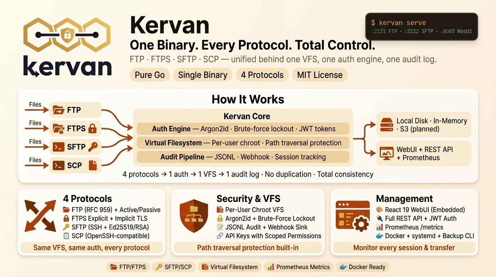

# Kervan — Unified File Transfer Server

> **One Binary. Every Protocol. Total Control.**

<p align="center">
  
</p>


**Kervan** (Turkish for *caravan*) is a single-binary, multi-protocol file transfer
server written in pure Go. It unifies FTP, FTPS, SFTP and SCP behind a shared
virtual filesystem, user store, session manager, audit engine and management API
— deployable as one static binary with no external runtime dependencies.

Owner: **ECOSTACK TECHNOLOGY OÜ** · Module: `github.com/kervanserver/kervan`

See [.project/SPECIFICATION.md](.project/SPECIFICATION.md) for the full product
specification. This README documents the **current shippable skeleton** and
marks aspirational items from the spec as *planned*.

## Highlights

- **4 protocols in 1 binary** — FTP, FTPS (explicit + implicit), SFTP and SCP
  share a single auth engine, VFS layer and audit pipeline.
- **Virtual Filesystem (VFS)** — per-user chroot, path traversal protection,
  pluggable backends (local disk, in-memory, S3-compatible object storage).
- **Local user store** — Argon2id / bcrypt password hashing, admin flag, enable
  /disable, stored in an embedded JSON-backed store under `data_dir`.
- **Session & transfer tracking** — live session registry and transfer manager
  surfaced through REST and Prometheus-style `/metrics`.
- **JSONL audit log** — every significant action is appended to a structured
  audit file (`data/audit.jsonl` by default).
- **Config system** — YAML file + environment overlay + defaults + validation,
  plus runtime-safe reload support for selected WebUI and security settings.
- **Embedded WebUI** — React 19 + Tailwind CSS 4.1 + shadcn/ui + lucide-react
  admin panel with dark/light theme and responsive layout, embedded from
  `internal/webui/dist`.
- **REST API** — auth, users, sessions, files, transfers, audit, server status
  and metrics behind JWT-style bearer tokens or scoped API keys.
- **Network security** — IP allow/deny lists and per-protocol connection caps
  on every listener, cross-protocol brute-force IP bans, password policy, and
  CSP/HSTS headers on the WebUI (see [Security](#security)).
- **Interop-tested** — CI drives a live server with OpenSSH `sftp`/`scp` and
  curl (FTP, FTPS, SFTP, SCP) in addition to the unit suites.
- **Zero external runtime deps** — only `golang.org/x/crypto` (SSH/Argon2id),
  `golang.org/x/sys` (file locking on Windows) and `gopkg.in/yaml.v3` as
  direct dependencies.

## Requirements

- **Go 1.26.1+** (toolchain pinned to `go1.26.8` in [go.mod](go.mod))
- Linux, macOS or Windows (tested on Windows 11, Linux amd64/arm64)

---

## Quick Start

```bash
# 1. Generate a default kervan.yaml
go run ./cmd/kervan init

# 2. Create the first admin user (required before starting the WebUI/API securely)
go run ./cmd/kervan admin create --username admin --password 'StrongPass123!'

# 3. Start the server (writes kervan.yaml on first run if missing)
go run ./cmd/kervan
```

Default listeners (see [kervan.example.yaml](kervan.example.yaml)):

| Service | Port  | Notes                                         |
|---------|-------|-----------------------------------------------|
| FTP     | 2121  | Passive range `50000-50100`                   |
| FTPS    | 2121 / 990 | Disabled by default; needs cert + key    |
| SFTP    | 2222  | Ed25519 host key in `data/host_keys/`         |
| SCP     | 2222  | Shares the SFTP SSH listener                  |
| WebUI   | 8080  | Also exposes REST `/api/*` and `/metrics`     |
| Debug   | 6060  | Disabled by default; localhost-only `pprof`   |

---

## CLI Commands

```bash
# Run the server
go run ./cmd/kervan                               # default kervan.yaml
go run ./cmd/kervan -config /etc/kervan/kervan.yaml

# Print version / build info
go run ./cmd/kervan version

# Generate a default config (refuses to overwrite unless --force)
go run ./cmd/kervan init
go run ./cmd/kervan init --config /etc/kervan/kervan.yaml --force

# Generate SSH host keys (ed25519 or rsa-4096)
go run ./cmd/kervan keygen --type ed25519 --output ./data/host_keys
go run ./cmd/kervan keygen --type rsa     --output ./data/host_keys

# Admin user management
go run ./cmd/kervan admin create         --username admin --password 'StrongPass123!'
go run ./cmd/kervan admin reset-password --username admin --password 'NewStrongPass123!'

# Create or restore an operational backup archive
go run ./cmd/kervan backup create  --config ./kervan.yaml --output ./backups/kervan-backup.zip
go run ./cmd/kervan backup restore --config ./kervan.yaml --input  ./backups/kervan-backup.zip --force
go run ./cmd/kervan backup verify  --input  ./backups/kervan-backup.zip

# Validate config and inspect a running instance
go run ./cmd/kervan check  --config ./kervan.yaml
go run ./cmd/kervan status --config ./kervan.yaml

# User management
go run ./cmd/kervan user list   --config ./kervan.yaml
go run ./cmd/kervan user create --config ./kervan.yaml --username alice --password 'StrongPass123!' --home-dir /uploads
go run ./cmd/kervan user delete --config ./kervan.yaml --username alice

# Discover API key presets and supported scopes
go run ./cmd/kervan apikey scopes
go run ./cmd/kervan apikey presets

# Manage API keys from the local store
go run ./cmd/kervan apikey list   --config ./kervan.yaml --username alice
go run ./cmd/kervan apikey create --config ./kervan.yaml --username alice --name "Automation key" --permissions files:read,files:write
go run ./cmd/kervan apikey revoke --config ./kervan.yaml --username alice --id <key-id>
```

API key scopes currently include surfaces such as `server:read`,
`files:read`, `files:write`, `share:write`, `audit:read`,
`sessions:write`, and `transfers:read`. Presets (`read-only`,
`automation`, `operations`, `read-write`) expand to curated scope sets.

---

## Build & Test

```bash
# Run the full test suite
go test ./...

# Run the same backend checks enforced in CI
go vet ./...
staticcheck ./...

# Run the WebUI behavior tests
cd webui && npm test

# Build the React WebUI and copy it to internal/webui/dist
go run ./scripts

# Build a static binary
go build -o kervan ./cmd/kervan

# Or via the provided Makefile targets
make build
make test
make compose-config
```

### Continuous integration

CI does **not** run automatically: pushes and pull requests trigger nothing.
Verify changes locally with:

```bash
make check   # gofmt, vet, staticcheck, tests, -race tests, WebUI tests,
             # and a check that internal/webui/dist matches webui/src
```

Run `make audit` before a release (or periodically) to scan for known
vulnerabilities with `govulncheck` and `npm audit`.

`make check` needs `staticcheck` (`go install honnef.co/go/tools/cmd/staticcheck@latest`),
Node.js for the WebUI, and a C toolchain for `-race`. The interop tests also
use `sftp`, `scp`, `ssh-keygen` and `curl` when they are installed.

When a hosted run is actually needed (e.g. before a release), start the CI
workflow manually from the GitHub Actions tab or with:

```bash
gh workflow run CI                   # backend, race and WebUI jobs
gh workflow run CI -f docker=true    # additionally build the Docker image
```

The Release workflow runs only when a `v*` tag is pushed (or manually), so
it also stays idle during normal development. It drafts the GitHub release
with the binaries and pushes the multi-arch container image to GHCR. To
(re)publish only the image for an existing tag:

```bash
gh workflow run Release --ref vX.Y.Z -f image_only=true   # tags from v0.1.1 on
```

## Logging

Kervan logs through Go's structured `slog` pipeline in either `json` or `text`
format. By default logs go to stdout, which is the recommended mode for
containers and supervised environments.

If `server.log_file` is set, Kervan now performs built-in size-based log
rotation:

```yaml
server:
  log_file: ./data/logs/kervan.log
  log_max_size_mb: 100
  log_max_backups: 5
```

Behavior:

- Rotation happens when the current file would grow past `log_max_size_mb`.
- Rotated files are kept as `kervan.log.1`, `kervan.log.2`, and so on.
- Only `log_max_backups` old files are retained.
- The log writer is closed cleanly during process shutdown.

For release builds, the repository now ships with [GoReleaser](.goreleaser.yml).
Tagged pushes like `v0.1.0` trigger the release workflow, rebuild the embedded
WebUI, publish platform archives and attach a `checksums.txt` file to a draft
GitHub Release.

```bash
# Validate the release config locally
make release-check

# Produce local snapshot artifacts in ./dist
make release-snapshot
```

## Docker

Release images for `linux/amd64` and `linux/arm64` are published to GHCR by
the Release workflow, tagged `<version>`, `<major>.<minor>` and `latest`:

```bash
docker pull ghcr.io/kervanserver/kervan:latest
```

Or build the image locally:

```bash
# Build the production image
docker build -t kervan:dev .

# Start with the bundled example config and bootstrap the first admin user
docker run --rm \
  -p 2121:2121 \
  -p 2222:2222 \
  -p 8080:8080 \
  -p 50000-50100:50000-50100 \
  -e KERVAN_ADMIN_PASSWORD='StrongPass123!' \
  -v kervan-data:/var/lib/kervan/data \
  kervan:dev
```

Container defaults:

- Runs as a non-root `kervan` user (`uid/gid 10001`).
- Uses `/var/lib/kervan/kervan.yaml` as the default config path.
- Persists runtime state under `/var/lib/kervan/data`.
- Exposes FTP (`2121`), FTPS implicit (`990`), SFTP/SCP (`2222`), WebUI/API
  (`8080`) and the passive FTP range (`50000-50100`).
- Ships with a `HEALTHCHECK` against `http://127.0.0.1:8080/health`.
- Does not expose the optional debug/`pprof` listener by default.
- Passive FTP clients connect to the address in `ftp.passive_ip`; set it to
  the Docker host's reachable IP, since the container's own address is not
  routable from outside.

Optional environment variables:

- `KERVAN_CONFIG` — override the config path used by the entrypoint.
- `KERVAN_ADMIN_USERNAME` — bootstrap admin username when using
  `KERVAN_ADMIN_PASSWORD`.
- `KERVAN_ADMIN_PASSWORD` — creates the first admin user on container startup if
  it does not already exist.
- Any `KERVAN_*` config override already supported by the binary, such as
  `KERVAN_SERVER__DATA_DIR` or `KERVAN_FTP__PORT`.

### Docker Compose

The repository now ships with a ready-to-run [docker-compose.yml](docker-compose.yml)
plus an [.env.example](.env.example) template.

```bash
# 1. Create local runtime files (both are gitignored)
cp .env.example .env
cp kervan.example.yaml kervan.yaml

# 2. Validate and start
make compose-config
make compose-up
```

Compose defaults:

- Builds the local image if it does not already exist.
- Mounts `./kervan.yaml` into the container as the active config file.
- Persists runtime state in the named volume `kervan-data`.
- Reads bootstrap credentials from `.env`.

### systemd

For Linux hosts running the released binary directly, an example unit file is
included at [deploy/systemd/kervan.service](deploy/systemd/kervan.service).

Typical installation flow:

```bash
sudo install -d -m 0750 -o root -g root /etc/kervan
sudo install -d -m 0750 -o kervan -g kervan /var/lib/kervan
sudo install -m 0644 deploy/systemd/kervan.service /etc/systemd/system/kervan.service
sudo install -m 0640 kervan.example.yaml /etc/kervan/kervan.yaml
sudo systemctl daemon-reload
sudo systemctl enable --now kervan
```

The unit is hardened for a non-root `kervan` user, includes automatic restart
on failure, and grants only `CAP_NET_BIND_SERVICE` so the service can bind
privileged ports like `990` without running as root.

---

## Protocols

### FTP (RFC 959 + extensions)

- Authentication, navigation (`CWD`, `PWD`, `LIST`, `NLST`), upload (`STOR`,
  `APPE`), download (`RETR`), rename, delete, mkdir / rmdir.
- Passive (`PASV`, `EPSV`) and active (`PORT`, `EPRT`) data channels.
  Configurable passive port range and advertised passive IP for NAT/firewall
  scenarios. Active mode can be turned off with `ftp.active_mode: false`; when
  on, the server only connects back to the control connection's own address
  on an unprivileged port (FTP bounce protection), and passive data
  connections are only accepted from the control connection's address.
- `TYPE A` is accepted for client compatibility; data is always transferred
  byte-for-byte (binary).
- `MLSD` / `MLST` machine-readable listings, `SIZE`, `MDTM`, `REST`, `APPE`.
- Per-connection idle and transfer timeouts.

### FTPS (RFC 4217)

- Explicit FTPS via `AUTH TLS`, `PBSZ` and `PROT`.
- Optional implicit FTPS listener on `ftps.implicit_port` (default `990`).
- Mode selector: `explicit`, `implicit`, or `both`.
- Configurable minimum / maximum TLS version and optional client-certificate
  authentication (`none` / `request` / `require` with `client_ca_file`).
- Enable by setting `ftps.enabled: true` and providing `cert_file` + `key_file`.
  A certificate configured only for `webui.tls` does not turn FTPS on.

### SFTP (SSH File Transfer Protocol)

- SSH transport built on `golang.org/x/crypto/ssh` with an Ed25519 host key
  auto-generated on first run (or pre-created with `kervan keygen`).
- SFTP v3 subsystem covering open/close/read/write, stat/lstat/fstat,
  setstat/fsetstat (truncate; permissions and times best-effort), readdir,
  mkdir/rmdir, remove, rename and realpath. Symlinks and extensions are
  reported as unsupported.
- Password and public-key authentication. Users' `authorized_keys` entries are
  standard OpenSSH lines (comments and options allowed); import them in bulk
  with `kervan migrate ssh-keys`.
- Works with OpenSSH `sftp`, OpenSSH 9+ `scp` (which uses SFTP by default),
  and libssh2-based clients such as curl.

### SCP (OpenSSH-compatible)

- Legacy SCP protocol (`scp -O`, libssh2/curl) in source and sink mode,
  including recursive directory copies (`-r`, nesting capped at 128 levels)
  and `-p` time preservation. OpenSSH 9+ `scp` uses SFTP by default.
- Shares the SSH listener with SFTP; no separate port.
- Operates through the same VFS and audit pipeline as SFTP.

---

## Virtual Filesystem

All protocols share a common VFS layer ([internal/vfs](internal/vfs)):

- **Per-user chroot** — every session is resolved against the user's home
  directory, with `..` normalization and symlink containment.
- **Mount resolver** — directory roots can be composed from multiple backends
  (foundation for the multi-mount model in Spec §4.3).
- **Backends shipped:**
  - `local` — filesystem directory rooted at `storage.backends.local.options.root`.
  - `memory` — in-process backend used for tests and ephemeral workloads.
- **Planned backends:** S3-compatible (AWS / MinIO / R2) with SigV4, multipart
  upload, directory emulation and metadata sidecar (Spec §4.4.2).

---

## Authentication & Users

- **Local provider** — users stored in the embedded JSON store under
  `server.data_dir`, protected by Argon2id (default) or bcrypt password hashes.
- **Admin flag** — admin users can manage other users through the REST API.
- **LDAP provider** — optional bind-based LDAP/AD authentication with group
  mapping; LDAP users are mirrored into the local store.
- **SSH public keys** and **WebUI TOTP** two-factor authentication.
- **Brute-force protection** — see [Security](#security).
- **Per-user home directory** — surfaced to every protocol as the VFS chroot.
- The CLI (`kervan user …`, `kervan admin …`, `kervan apikey …`) can be used
  while the server is running: the store is shared safely between processes
  and changes are visible to the server immediately.
- **Groups** — permission and quota templates; see [Groups](#groups).
- **OIDC single sign-on** for the WebUI; see [Single sign-on](#single-sign-on-oidc).
- **Not supported in this release:** SSH certificate
  and keyboard-interactive authentication, account expiry.

---

## Single sign-on (OIDC)

The WebUI can sign users in through any OpenID Connect provider (Keycloak,
Authentik, Okta, Microsoft Entra ID, Google, Dex, ...). It uses discovery,
the authorization-code flow with PKCE, and verifies ID tokens against the
provider's JWKS (RS/PS/ES/EdDSA). SSO covers the WebUI and API session only;
FTP/SFTP users keep signing in with passwords or SSH keys.

```yaml
webui:
  oidc:
    enabled: true
    issuer: https://login.example.com/realms/acme
    client_id: kervan
    client_secret: change-me            # or KERVAN_WEBUI__OIDC__CLIENT_SECRET
    redirect_url: https://files.example.com/api/v1/auth/oidc/callback
    scopes: [openid, profile, email, groups]
    button_label: Sign in with Acme
    username_claim: preferred_username,email   # tried in order
    groups_claim: groups
    allowed_groups: [kervan-users]      # optional: restrict who may sign in
    admin_groups: [kervan-admins]       # optional: role synced at each sign-in
    group_mapping:                      # provider group -> Kervan group
      Engineering: eng
    auto_create: true
    home_dir: /{username}
```

Register `redirect_url` as the client's redirect URI at the provider.

- **Accounts:** on first sign-in an account with `auth_provider: oidc` is
  created (`auto_create: false` requires an admin to create it). It is bound
  to the provider's `sub` and has no usable password.
- **Takeover protection:** a provider can never sign in to an existing local
  or LDAP account with the same username, nor to an OIDC account bound to a
  different subject (`account_conflict`).
- **Email as username:** an `email` claim is used only when the provider
  marks it verified or does not say.
- **Roles:** with `admin_groups` set, the role is recomputed at every
  sign-in, so leaving the group demotes the user. Without it, new users are
  regular users and an admin-granted role is kept.
- **Groups:** provider groups map to Kervan groups through `group_mapping`,
  or by identical name. The first match becomes the primary group. The
  memberships are synced only when the token carries the groups claim.
- **Sessions and MFA:** sign-in hands the session to the WebUI through a
  one-time code, so the token never appears in a URL. Kervan's own TOTP is
  not applied to SSO sign-ins; enforce MFA at the provider.
- **Troubleshooting:** failures land on the login screen with a short reason
  (`not_allowed`, `account_conflict`, `invalid_state`, ...). Details, such
  as which claims the token carried, are logged at `WARN`.

## Groups

Groups are permission and storage-quota templates:

- A user's **primary group** supplies their permissions (upload, download,
  delete, rename, create folders, list, chmod) and quota. Set
  `custom_permissions` on the user to use the user's own permissions instead,
  and `max_storage` to give them their own quota (`0` inherits, `-1` is
  unlimited). A group's `max_storage` of `0` falls back to
  `quota.default_max_storage`. Quotas only apply when `quota.enabled` is
  true, and never to admins.
- **Secondary groups** record membership only.
- Renaming a group updates its members. A group with members can only be
  deleted with `force`, which removes the memberships.
- A primary group that does not exist in Kervan (e.g. a raw LDAP group name)
  is ignored, and the user keeps their own permissions. Create a Kervan group
  with the same name to apply a template to LDAP users.

Manage groups in the WebUI (**Groups** page, plus the **Edit** dialog on the
Users page), through `/api/v1/groups` (`users:read` / `users:write` API key
scopes), or from the CLI:

```bash
kervan group create --name readonly --permissions download,list_dir --max-storage 524288000
kervan user create --username ann --password 'S3cure-pass!' --group readonly
kervan group list
kervan group delete --name readonly --force
```

User import/export carries `primary_group` and `max_storage`.

---

## Session & Transfer Tracking

- `internal/session` tracks live sessions (protocol, client IP, bytes in/out,
  last activity) and exposes them via `/api/v1/sessions`.
- `internal/transfer` records in-flight and recent transfers with bytes and
  duration; surfaced via `/api/v1/transfers` and `/metrics`.
- `/metrics` returns a Prometheus-style text exposition covering active
  sessions, transfer counters, server uptime, and HTTP request counters /
  latency aggregates grouped by normalized route + status code.
- The HTTP middleware emits structured access logs with request ID, route,
  status, duration and authenticated username for every completed request.
- Incoming `Traceparent` headers are preserved in responses and logs; if a
  client does not send one, Kervan generates a fresh trace context and exposes
  it via `Traceparent` and `X-Trace-ID`.

## Debug & Profiling

Kervan now supports an optional, separate debug listener for Go `pprof`.
It is disabled by default and binds to `127.0.0.1:6060` when enabled, so it
does not share the public WebUI/API port.

Example config:

```yaml
debug:
  enabled: true
  bind_address: 127.0.0.1
  port: 6060
  pprof: true
```

Available endpoints when enabled:

- `/health` — lightweight debug listener health probe
- `/debug/pprof/` — pprof index
- `/debug/pprof/heap`
- `/debug/pprof/goroutine`
- `/debug/pprof/profile`
- `/debug/pprof/trace`

The main `/health` response also reports the debug listener as a separate
subsystem check.

---

## Audit Log

- Structured events (login, upload, download, delete, rename, mkdir, session
  open/close) are written as JSON lines to `data/audit.jsonl` by default.
- `audit.outputs[]` supports `file`, `http`, `webhook` and `syslog` sinks.
- File output path is configurable via `audit.outputs[].path` in `kervan.yaml`.
- HTTP/webhook outputs support custom headers, batch size, flush interval and
  retry count for downstream audit collectors.
- Events are also queryable over the REST API at `/api/v1/audit/events`.
- `kervan backup create` packages the embedded store, its `.bak` recovery copy,
  the audit log and the active config into a ZIP archive for offline recovery.
- `kervan backup verify` validates the ZIP structure and, when a manifest is
  present, verifies all recorded file sizes and SHA-256 checksums.
- `kervan backup restore` restores those files back into the current
  `server.data_dir`; use it with the server stopped for the cleanest recovery.
- Backup manifests now carry per-file SHA-256 checksums, and restore verifies
  them before writing recovered files back to disk.

Example:

```yaml
audit:
  enabled: true
  outputs:
    - type: file
      path: ./data/audit.jsonl
    - type: webhook
      url: https://audit.example.com/events
      headers:
        Authorization: Bearer change-me
      batch_size: 50
      flush_interval: 5s
      retry_count: 3
    - type: syslog
      url: tls://siem.example.com:6514   # udp://, tcp://, tls://, unix:///dev/log, unixgram:///dev/log
      format: cef                        # rfc5424 (default) or cef
      facility: authpriv                 # default local0
```

Syslog outputs work as follows:

- **Format:** RFC 5424 messages. With `format: rfc5424`, the event fields
  travel as structured data (`[kervan@32473 id=… user=… protocol=… path=…
  ip=… status=…]`). With `format: cef`, the message body is an ArcSight CEF
  line (`suser`, `src`/`spt`, `app`, `filePath`, `outcome`, `msg`, `rt`,
  `externalId`).
- **Severity:** failed logins and rejected connections are `warning`, other
  events `informational`.
- **Transport:** TCP, TLS and `unix` streams use RFC 6587 octet-counting
  framing and reconnect automatically. TLS verifies the collector against
  the system roots. Field values are escaped, and control characters are
  stripped, so audit data cannot forge extra records.
- **Delivery:** syslog delivery is best effort. UDP can drop messages, and a
  message written just as a TCP collector closes the connection can be lost.
  Keep a `file` output as the record of truth.

*Still planned:* queryable audit storage and an HMAC-chained immutable mode.

---

## REST API

The management API is served from the same process as the WebUI (default
`:8080`). All non-login endpoints require a bearer token obtained from
`POST /api/v1/auth/login`.

| Method | Path                     | Description                                   |
|--------|--------------------------|-----------------------------------------------|
| `GET`  | `/health`                | Unauthenticated liveness + subsystem checks   |
| `GET`  | `/metrics`               | Prometheus-style text metrics                 |
| `POST` | `/api/v1/auth/login`         | Exchange username + password for a token  |
| `GET`  | `/api/v1/server/status`      | Server status snapshot                    |
| `GET`  | `/api/v1/server/config`      | Redacted runtime config (admin)           |
| `PUT`  | `/api/v1/server/config`      | Update config with JSON patch (admin)     |
| `POST` | `/api/v1/server/config/validate` | Validate config patch without write (admin) |
| `POST` | `/api/v1/server/reload`      | Validate/reload config file (admin)       |
| `GET`  | `/api/v1/users`              | List users (admin)                        |
| `POST` | `/api/v1/users`              | Create user (admin)                       |
| `DELETE` | `/api/v1/users?id=…`       | Delete user (admin)                       |
| `GET`  | `/api/v1/apikeys`            | List API keys plus supported scopes/presets |
| `POST` | `/api/v1/apikeys`            | Create scoped API key (shown once)        |
| `DELETE` | `/api/v1/apikeys?id=…`     | Revoke API key                            |
| `GET`  | `/api/v1/sessions`           | Active session list                       |
| `GET`  | `/api/v1/files/{user}/ls`    | List directory contents                   |
| `GET`  | `/api/v1/files/{user}/stat`  | File or directory metadata                |
| `POST` | `/api/v1/files/{user}/mkdir` | Create directory                          |
| `POST` | `/api/v1/files/{user}/rename`| Rename or move file/directory            |
| `POST` | `/api/v1/files/{user}/share` | Create file share link                    |
| `POST` | `/api/v1/files/{user}/upload`| Upload file content                       |
| `GET`  | `/api/v1/files/{user}/download` | Stream file download                   |
| `DELETE` | `/api/v1/files/{user}/rm`  | Remove file or directory                  |
| `GET`  | `/api/v1/share`              | List own share links                      |
| `DELETE` | `/api/v1/share?token=…`    | Revoke a share link                       |
| `GET`  | `/api/v1/share/{token}`      | Public share download                     |
| `GET`  | `/api/v1/transfers`          | Transfer registry (active + recent)      |
| `GET`  | `/api/v1/audit/events`       | Paginated audit events                    |
| `GET`  | `/api/v1/ws?types=server,sessions,transfers,audit` | WebSocket live snapshots |

WebSocket clients authenticate with an `Authorization: Bearer` header or, from
browsers (which cannot set that header), by offering `auth.<token>` in
`Sec-WebSocket-Protocol` alongside `kervan.v1`, as the bundled WebUI does.
Tokens are never accepted in the URL, and the server only echoes `kervan.v1`.
Bearer token signing keys are persisted under `data_dir`, so valid sessions now
survive normal process restarts as long as the same data directory is reused.

The full `/api/v1/...` surface from Spec §8.4 still has planned gaps (groups,
bulk import/export, advanced server config editing).
The reload endpoint applies runtime-safe settings immediately —
`webui.session_timeout`, `webui.totp_enabled`, `webui.cors_origins`,
`auth.min_password_length`, `auth.require_special_char`,
`security.allowed_ips`, `security.denied_ips` and every
`security.brute_force.*` key — and returns `applied_paths` / `restart_paths`
so callers can see what still needs a restart.

---

## WebUI

The binary embeds a React 19 WebUI from [webui](webui) at runtime through
`embed.FS`:

- Tailwind CSS 4.1 design system with shadcn/ui component patterns
- lucide-react icon set
- Dark/light theme switch via the built-in React theme context
- Responsive navigation and page layouts for desktop/mobile
- API-integrated pages: dashboard, users, sessions, files, transfers, audit, monitoring, API keys

---

## Configuration

The full configuration schema with defaults lives in
[kervan.example.yaml](kervan.example.yaml). On first run, if `kervan.yaml` does
not exist, the server writes a default copy and continues startup. Every config
key can be overridden with a `KERVAN_<SECTION>__<KEY>` environment variable
(double underscore between levels, e.g. `KERVAN_FTP__PORT=2221`).

For secure first startup, `webui.admin_password` now defaults to empty and
cross-origin access is disabled by default. Either create the admin explicitly
with `kervan admin create` before starting, or set a strong
`webui.admin_password` for the first boot. If you need browser access from a
different origin, set `webui.cors_origins` to an explicit allowlist. The API
listener also ships with bounded `webui.read_timeout`, `webui.read_header_timeout`,
`webui.write_timeout` and `webui.idle_timeout` defaults so slow clients do not
hold the management port open indefinitely.

Key sections: `server`, `ftp`, `ftps`, `sftp`, `scp`, `webui`, `auth`,
`storage`, `quota`, `audit`, `security`, `mcp`.

### FTPS notes

- Set `ftps.enabled: true` and provide both `ftps.cert_file` and
  `ftps.key_file`, or enable the experimental ACME client with
  `ftps.auto_cert`.
- `ftps.client_auth: request|require` verifies client certificates against
  `ftps.client_ca_file` on the FTPS listeners only (the WebUI is unaffected).
- Pick `ftps.mode` as `explicit`, `implicit`, or `both`.
- Implicit mode listens on `ftps.implicit_port` (default `990`).
- `ftps.min_tls_version` / `ftps.max_tls_version` accept `"1.2"` / `"1.3"`.

### SFTP notes

- Host keys are stored under `sftp.host_key_dir` and auto-generated on first
  start if missing. Use `kervan keygen` to pre-create them.
- Interactive shells and port forwarding are never offered; only the SFTP
  subsystem and `scp` exec requests are served.

---

## Security

All listeners (FTP, FTPS, SFTP/SCP and the WebUI/API) share these controls:

- **IP filtering** — `security.allowed_ips` / `security.denied_ips` accept IPs
  and CIDRs (IPv4 and IPv6). A deny entry always wins; a non-empty allow list
  admits only matching clients. Rejected FTP/SSH connections are closed before
  any banner; the API answers `403`. `/health` stays reachable for local probes.
  Both lists are reloadable at runtime. Behind a reverse proxy the API sees the
  proxy's address, so filter WebUI clients at the proxy.
- **Connection caps** — `ftp.max_connections` and `sftp.max_connections`
  bound concurrent control/SSH connections (`0` = unlimited). Over-limit FTP
  clients get `421`; each rejection is audited as `connection.rejected`.
- **Brute-force protection** (`security.brute_force`) — per-account lockout
  after `max_attempts` failures for `lockout_duration`, plus a per-address ban
  after `ip_ban_threshold` failed logins within `ip_ban_duration`. The address
  ban is shared by FTP, SFTP and the API, so failures on one protocol lock the
  address out of all of them; IPv6 clients are grouped per /64.
  `whitelist_ips` exempts addresses from the ban.
- **Password policy** — `auth.min_password_length` and
  `auth.require_special_char` apply to the API, the WebUI and the CLI.
- **HTTP hardening** — strict `Content-Security-Policy` (no inline scripts
  beyond the hashed theme bootstrap), `X-Frame-Options: DENY`, `nosniff`,
  `Referrer-Policy`, and `Strict-Transport-Security` on TLS connections.
- **Settings without effect** — a few keys are accepted for compatibility but
  do nothing in this release (`ftp.ascii_transfer`,
  `sftp.host_key_algorithms`, `sftp.disable_shell`, `auth.default_provider`,
  `auth.ldap.connection_pool_size`, `quota.default_max_files`,
  `quota.check_interval`, `mcp.transport` other than `stdio`). The server logs
  a warning at startup when one of them is changed from its default.

---

## Project Layout

```
cmd/kervan/              # Entry point + CLI subcommands (init, keygen, admin, version)
internal/
  api/                   # REST API router, JWT-style tokens, file/audit handlers
  audit/                 # Event schema + JSONL file sink
  auth/                  # Auth engine, user repo, Argon2id/bcrypt hashing
  build/                 # Version & build metadata
  config/                # Loader, defaults, env overlay and validation
  crypto/                # TLS config builder, SSH host-key generation
  protocol/
    ftp/                 # FTP (and FTPS wrapper) server
    sftp/                # SFTP + SCP subsystem over SSH
  server/                # Top-level Application wiring all subsystems
  session/               # Session manager
  storage/
    local/               # Local filesystem backend
    memory/              # In-memory backend
  store/                 # Embedded JSON-backed key-value store
  transfer/              # Transfer tracker
  util/                  # Logging, ULID generation helpers
  vfs/                   # VFS interface, resolver, mount registry, user VFS
  webui/                 # embed.FS handler for the bundled dashboard
kervan.example.yaml      # Reference configuration
.project/SPECIFICATION.md  # Full product specification
```

---

## Roadmap

Shipped in the current release: FTP/FTPS/SFTP/SCP, local + LDAP auth with
TOTP and SSH keys, local/memory/S3 storage, quotas, share links, API keys,
audit file + webhook sinks, backup/restore, migrations, the WebUI with live
WebSocket updates, Prometheus metrics, and the `stdio` MCP server.

Planned beyond v1.0 (see [.project/SPECIFICATION.md](.project/SPECIFICATION.md)):

- FTP `HOST` virtual hosting.
- Syslog/CEF and queryable audit storage, HMAC-chained logs.
- A database-backed metadata store for large installations.

---

## License

Open source — MIT or Apache 2.0 (to be finalized per Spec §0).
